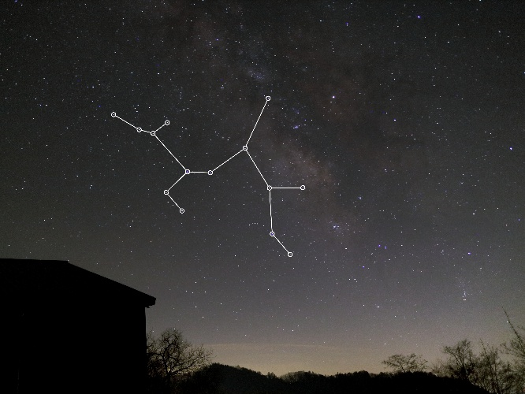

# stardust
星座検出プログラム  

## Example
(Photo by Rikuo Uchiki)  

|input|output|
|---|---|
||| 
 

## Requirements
```
opencv-python==3.4.0
numpy==1.14.0
```  

## Usage
```
$ git clone https://github.com/takasa5/stardust
$ cd stardust
```
```python
from stardust import Stardust
import Constellation as cs

# 入力画像のパス(or ndarray化した画像)で初期化
sd = Stardust("./input.jpg")
# 検出したい星座を指定
cstl = cs.Sagittarius() # いて座
# 星座線を引く(あれば)
sd.draw_line(cstl)
# 画像を返す
ret = sd.get_image()
# cv2.imshow()なり cv2.imwrite()なりする
```

## TODO
- [ ] 精度向上
- [ ] 星座データの追加
    - [ ] おひつじ座(Aries)
    - [ ] おうし座(Taurus)
    - [ ] ふたご座(Gemini)
    - [ ] かに座(Cancer)
    - [ ] しし座(Leo)
    - [ ] おとめ座(Virgo)
    - [ ] てんびん座(Libra)
    - [x] さそり座(Scorpius)
    - [x] いて座(Sagittarius)
    - [ ] やぎ座(Capricornus)
    - [ ] みずがめ座(Aquarius)
    - [ ] うお座(Pisces)
    - データを紹介してくれる方、撮影した写真を提供してくれる方を募集しています
- [x] 星座名の付記
    - 文字の大きさ、太さは要調整
- [ ] 星座間位置関係の考慮
- [ ] 同じ星を二度以上通る場合の考慮
